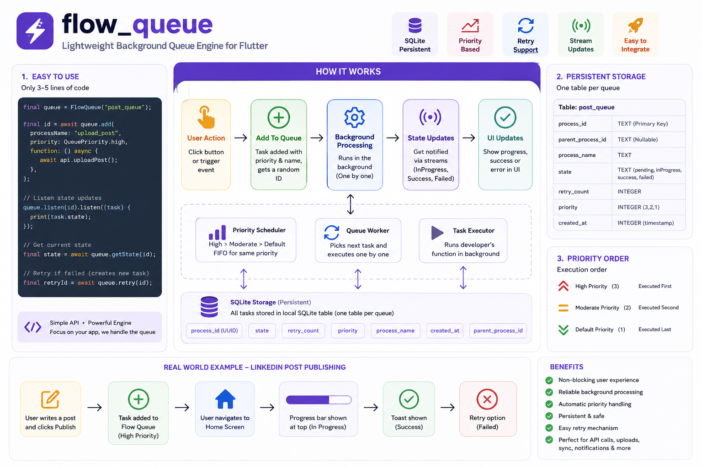

# Flow Queue

A lightweight persistent background queue engine for Flutter.

`flow_queue` helps developers process API calls, uploads, background workflows, and retryable tasks without blocking the UI.

Designed for modern mobile app workflows like:

* LinkedIn post publishing
* Instagram uploads
* Offline-first sync
* Deferred API processing
* Background task execution

---

# Features

## Phase 1 Features

* Persistent SQLite queue
* Priority-based processing
* FIFO execution
* Retry support
* Task state management
* Stream-based updates
* Multiple queue support
* Random UUID task IDs
* Simple developer API

---

# Why Flow Queue?

Most Flutter apps follow this pattern:

```text
User Action
   ↓
API Request
   ↓
Loading Screen
   ↓
Response
```

This creates:

* blocked UI
* poor UX
* retry complexity
* repeated state management

Flow Queue changes the workflow:

```text
User Action
   ↓
Task Added To Queue
   ↓
User Continues Using App
   ↓
Background Processing
   ↓
Success / Failure Updates
```

---

# Installation

Add dependency:

```yaml
dependencies:
  flow_queue: ^1.0.0
```

Run:

```bash
flutter pub get
```

---

# Quick Start

## Initialize Queue

```dart
final queue = FlowQueue("post_queue");

await queue.init();
```

---

# Add Task

```dart
final id = await queue.add(
  processName: "upload_post",
  priority: QueuePriority.high,
  function: () async {

    await api.uploadPost();

  },
);
```

---

# Listen Task State

```dart
queue.listen(id).listen((task) {

  print(task.state);

});
```

---

# Get Current State

```dart
final state = await queue.getState(id);
```

---

# Retry Failed Task

```dart
final retryId = await queue.retry(id);
```

Retry creates:

* new process ID
* new queue item
* preserved retry history

---

# Queue Priority

## Available Priorities

```dart
QueuePriority.high
QueuePriority.moderate
QueuePriority.defaultPriority
```

---

# Queue Processing Rules

## Execution Order

```text
HIGH → MODERATE → DEFAULT
```

---

## Same Priority Rule

FIFO execution:

```text
First In → First Out
```

Older tasks execute first.

---

# Task States

```dart
QueueState.pending
QueueState.inProgress
QueueState.success
QueueState.failed
```

---

# Example

## LinkedIn-style Post Upload

```dart
final queue = FlowQueue("posts");

final id = await queue.add(
  processName: "publish_post",
  priority: QueuePriority.high,
  function: () async {

    await api.publishPost();

  },
);

queue.listen(id).listen((task) {

  switch(task.state) {

    case QueueState.inProgress:
      print("Uploading...");
      break;

    case QueueState.success:
      print("Post Published");
      break;

    case QueueState.failed:
      print("Upload Failed");
      break;

    default:
      break;
  }

});
```

---

# Multiple Queues

Flow Queue supports multiple independent queues.

```dart
final uploadQueue = FlowQueue("upload_queue");

final paymentQueue = FlowQueue("payment_queue");

final analyticsQueue = FlowQueue("analytics_queue");
```

Each queue creates:

* separate SQLite table
* separate processing workflow

---

# Internal Architecture

```text
Flow Queue
│
├── SQLite Storage
├── Queue Worker
├── Priority Scheduler
├── Retry Engine
├── State Stream System
└── Task Executor
```

---

# SQLite Schema

```sql
CREATE TABLE queue_name (
    process_id TEXT PRIMARY KEY,
    parent_process_id TEXT,
    process_name TEXT NOT NULL,
    state TEXT NOT NULL,
    retry_count INTEGER DEFAULT 0,
    priority INTEGER NOT NULL,
    created_at INTEGER NOT NULL
);
```

---

# Dependencies

* sqflite
* path
* uuid

---

# Phase 1 Limitations

Current version does NOT support:

* app killed recovery
* true OS background execution
* isolate execution
* connectivity auto retry
* push notifications
* concurrent workers

These features are planned for future releases.

---

# Planned Features

## Phase 2

* isolate execution
* connectivity handling
* auto retry
* app restart recovery
* queue pause/resume
* worker concurrency
* task serialization
* background services

---

# Best Use Cases

* API queue processing
* Post publishing
* File uploads
* Chat message queue
* Offline-first apps
* Background sync
* Retryable workflows

---

# Example Architecture

```text
User Action
   ↓
Flow Queue
   ↓
SQLite Persistence
   ↓
Background Processing
   ↓
State Updates
   ↓
UI Notification
```

---

# Performance Notes

Flow Queue Phase 1 uses:

* single worker architecture
* sequential execution
* SQLite persistence

Optimized for:

* reliability
* simplicity
* predictable execution

---

# Contributing

Contributions are welcome.

Ideas:

* queue dashboard
* analytics
* isolate workers
* devtools integration
* connectivity sync
* notification system

